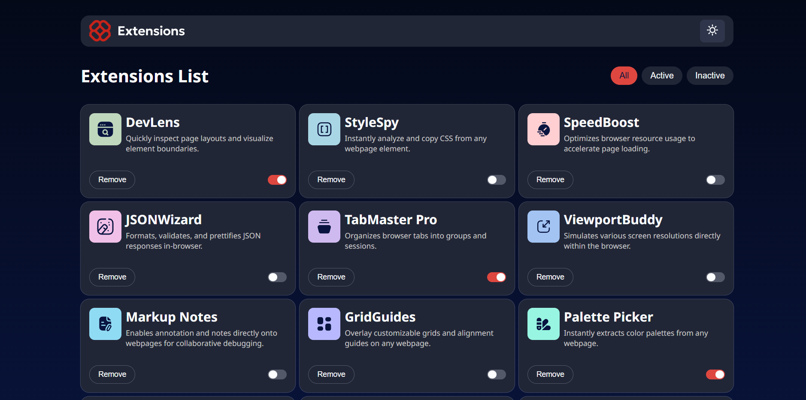
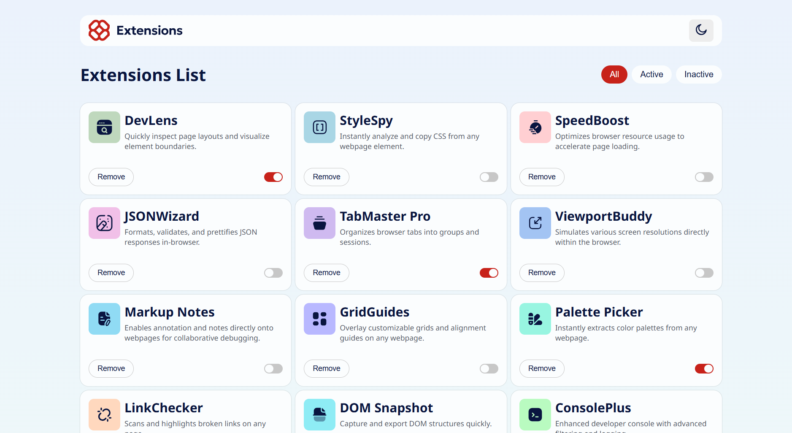

# Frontend Mentor - Browser extensions manager UI solution

This is a solution to the [Browser extensions manager UI challenge on Frontend Mentor](https://www.frontendmentor.io/challenges/browser-extension-manager-ui-yNZnOfsMAp). Frontend Mentor challenges help you improve your coding skills by building realistic projects.

## Table of contents

- [Overview](#overview)
  - [The challenge](#the-challenge)
  - [Screenshots](#screenshots)
- [My process](#my-process)
  - [Built with](#built-with)
  - [What I learned](#what-i-learned)
- [Author](#author)

## Overview

### The challenge

Users should be able to:

- Toggle extensions between active and inactive states
- Filter active and inactive extensions
- Remove extensions from the list
- Select their color theme
- View the optimal layout for the interface depending on their device's screen size
- See hover and focus states for all interactive elements on the page

### Screenshots

<strong>Desktop Dark Mode</strong>

<strong>Desktop Light Mode</strong>

## My process

### Built with

- Semantic HTML5 markup
- CSS custom properties
- Flexbox
- CSS Grid
- Mobile-first workflow
- React - JS library

### What I learned

- Managing application state in a parent component and passing data through props.
- Updating arrays in React using `map()` and `filter()`.
- Implementing light and dark themes using CSS custom properties.

## Author

- GitHub – [theOroszlan](https://github.com/theoroszlan)
- Frontend Mentor – [@theOroszlan](https://www.frontendmentor.io/profile/theOroszlan)
